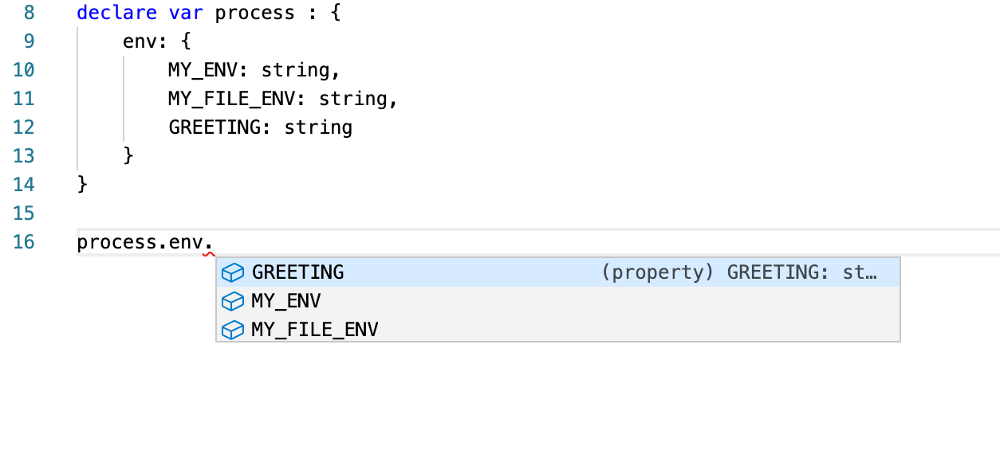

# How To Tell The Difference Between Development And Production In Node.Js?

Node.Js is a runtime environment able to run Javascript code outside a web browser.
It can run on a web-server. It can run on the user's local computer. It can run
everywhere. Of course, this is great. But sometimes the question raises: _"Where
does it run right now?"_

Answering this question is important beyond pure curiosity. As the developer of
a Node.Js application, you need to tell the difference between your app running
while you're developing it (referred to as "development") and your app running
on the server or the user's computer (referred to as "production").

_"That's easy,"_ you say. _"I know when my app runs during development because I
started it."_

But does your app know, too? 

_"Why would my app need to know that?"_

While not every application needs to know whether it runs on the developer's
machine or in production, most do.

Let's say your app connects to a database
to store transactions. You wouldn't want to insert and delete fake transactions
you made up during development into your actual database. Would you?

Let's say your app reads data from the file system. Can you assure all paths and
files on your development machine to match their counter parts in production?

In whatever way your app interacts with its environment, usually, this is something
you want to do a little bit differently during development than in production. And
in order to specify the behaviour of your app depending on the environment it runs
in, you need to know this environment inside your app.

---

Appropriately, the solution's name is **environment variables**. Unlike normal
variables, an environment variable's value is not set inside the app. But an
environment variable's value is set outside the app - in its environment.

Let's say you have a script to greet the world (`src/env_example/index.js`):

<Source title="src/env_example/index.js" language="js" source="env_example/index" tag="hello_world"/>

<Comment source="env_example/index" tag="run_basic" />

<!-- with prepended variable assignment -->

<Comment source="env_example/index" tag="hello_env" />

<Source source="env_example/index" tag="hello_env" />

<Comment source="env_example/index" tag="run_env" />

---

<!-- with .env variable assignment -->

Of course, prepending environment variables when you run 
the `node`-command can become cumbersome. Especially. when
you have a lot of variables.

<Comment source="env_example/index" tag="hello_file" />

<Comment source="env_example/index" tag="run_file" />

<Source source="env_example/index" tag="run_file" />

---

## How about Typescript?

For Typescript is a typed superset of Javascript, all the
examples work in Typescript, too. A major reason to use
Typescript is the support you get from your IDE. For instance,
auto-completion.

Wouldn't it be good if our IDE told us which environment variables
exist as we type?

<Comment source="env_example/env.d" tag="declare_file" />

```ts
declare var process : {
    env: {
        MY_ENV: string,
        MY_FILE_ENV: string,
        GREETING: string
    }
}
```
<!--Source source="env_example/env.d" tag="declare_file" /-->

The following image depicts how my IDE offers auto-completion
for my customized `process.env`.



---

Now, that we know how we can tell our app about the environment it 
is in, let's come back to our question _"Where
does the app run right now?"_ and the answer we gave: _"I know when
my app runs during development because I started it."_

In order to configure our app according to the environment, we
need to make sure to either prepend the right environment variables
when we start our app during development or in production. Or we
need to make sure we distribute the `.env`-file with the correct
values to the different environments.

Each environment has its own `.env`-file. Consequently, it is good
practice to **not** add `.env`-files to the git-repository but to
add them to `.gitignore`.

---

<!-- 
`env` variables during compilation. See: [babel env](https://babeljs.io/docs/en/config-files#apienv)
or [Webpack env](https://webpack.js.org/guides/environment-variables/)

The script is a `nodemon` / `babel-node` script

You can either add "env" property to nodemon.json, like this:

```json
"env": {
    "__DEV__": "true"
}
```

-->

